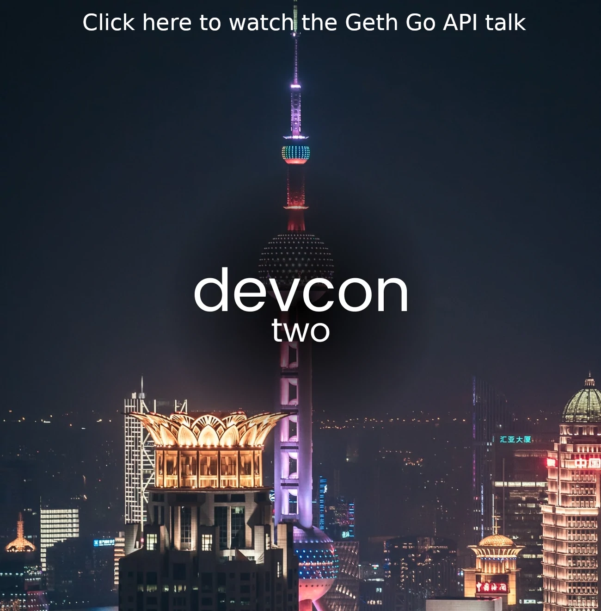

Zond was originally conceptualized to be the base layer for [Web3](https://zond.org/en/web3/), providing the backbone for a new generation of decentralized, permissionless and censorship resistant applications called [dapps](https://zond.org/en/glossary/#dapp). The first step towards this vision was the development of clients providing an RPC interface into the peer-to-peer protocols. This allowed users to transact between accounts and interact with smart contracts using command line tools. Gzond was one of the original clients to provide this type of gateway to the Zond network.

Before long, web-browser-like graphical interfaces (e.g. Mist) were created to extend clients, and client functions were built into websites built using the time-tested HTML/CSS/JS stack. However, to support the most diverse, complex dapps, developers require programmatic access to client functions through an API. This opens up client technologies as re-usable, composable units that can be applied in creative ways by a global community of developers.

To support this, Gzond ships official Go packages that can be embedded into third party desktop and server applications. There is also a [mobile API](/docs/developers/dapp-developer/mobile) that can be used to embed Gzond into mobile applications.

This page provides a high-level overview of the Go API.

_Note, this guide will assume some familiarity with Go development. It does not cover general topics about Go project layouts, import paths or any other standard methodologies. If you are new to Go, consider reading [Getting Started with Go](https://github.com/golang/go/wiki#getting-started-with-go) first._

## Overview \{#overview}

Gzond's reusable Go libraries focus on three main usage areas:

- Simplified client side account management
- Remote node interfacing via different transports
- Contract interactions through auto-generated bindings

The libraries are updated synchronously with the Gzond GitHub repository. The Go libraries can be viewed in full at [Go Packages](https://pkg.go.dev/github.com/zond/go-zond#section-directories).

Péter Szilágyi (@karalabe) gave a high level overview of the Go libraries in a talk at DevCon2 in Shanghai in 2016. The slides are still a useful resource ([available here](https://zond.karalabe.com/talks/2016-devcon.html)) and the talk itself can be viewed by clicking the image below (it is also archived on [IPFS](https://ipfs.io/ipfs/QmQRuKPKWWJAamrMqAp9rytX6Q4NvcXUKkhvu3kuREKqXR)).

[](https://www.youtube.com/watch?v=R0Ia1U9Gxjg)

## Go packages \{#go-packages}

The `go-zond` library is distributed as a collection of standard Go packages straight from go-zond's GitHub repository. The packages can be used directly via the official Go toolkit, without needing any third party tools.

The canonical import path for Gzond is `github.com/zond/go-zond`, with all packages residing underneath. Although there are [lots of them](https://pkg.go.dev/github.com/zond/go-zond/#section-directories) most developers will only care about a limited subset.

All the Gzond packages can be downloaded using:

```sh
$ go get -d github.com/zond/go-zond/...
```

More Go API support for dapp developers can be found on the [Go Contract Bindings](/docs/developers/dapp-developer/native-bindings) and [Go Account Management](/docs/developers/dapp-developer/native-accounts) pages.

## Tutorial \{#tutorial}

This section includes some basic usage examples for the `ethclient` and `gzondclient` packages available as part of the Go API. The `ethclient` package provides a client that implements the full Zond JSON-RPC API, whereas `gzondclient` offers the Gzond-specific API.

### Instantiating a client \{#instantiating-a-client}

The client is an instance of the `Client` struct which has associated functions that wrap requests to the Zond or Gzond RPC API endpoints.

A client is instantiated by passing a raw url or path to an ipc file to the client's `Dial` function. In the following code snippet the path to the ipc file for a local Gzond node is provided to `ethclient.Dial()`.

```go
// create instance of ethclient and assign to cl
cl, err := ethclient.Dial("/tmp/gzond.ipc")
if err != nil {
	panic(err)
}
_ = cl
```

### Interacting with the client \{#interacting-with-a-client}

The client can now be used to handle requests to the Gzond node using the full JSON-RPC API. For example, the function `BlockNumber()` wraps a call to the `zond_blockNumber` endpoint. The function `SendTransaction` wraps a call to `zond_sendTransaction`. The full list of client methods can be found [here](https://pkg.go.dev/github.com/zond/go-zond/ethclient#Client).

Frequently, the functions take an instance of the `Context` type as their leading argument. This defines context about requests sent from the application such as deadlines, cancellation signals etc. More information on this can be found in the [Go documentation](https://pkg.go.dev/golang.org/x/net/context). An empty context instance can be created using `Context.Background()`.

### Querying client for data \{#querying-client-for-data}

A simple starting point is to fetch the chain ID from the client. This e.g. is needed when signing a transaction as is to be seen in the next section.

```go
chainid, err := cl.ChainID(context.Background())
if err != nil {
    return err
}
```

Unlike `ChainID`, many functions require arguments other than context. The Go API takes in and returns high-level types which are used in Gzond internals as well to simplify programming and remove the need for knowing how data needs to be formatted exactly as per the JSON-RPC API spec. For example to find out the nonce for an account at a given block the address needs to be provided as a `common.Address` type and the block number as a `*big.Int`:

```go
addr := common.HexToAddress("0xb02A2EdA1b317FBd16760128836B0Ac59B560e9D")
nonce, err := cl.NonceAt(context.Background(), addr, big.NewInt(14000000))
```

### Querying past events \{#querying-past-events}

Contracts emit events during execution which can be queried from the client. The parameters for the event one is interested in have to be filled out in the `zond.FilterQuery` object. This includes which event topics are of interest, from which contracts and during which range of blocks. The example below queries `Transfer` events of all ERC-20 tokens for the last 10 blocks:

```go
blockNumber, err := cl.BlockNumber(context.Background())
if err != nil {
	fmt.Println("Failed to retrieve block number:", err)
	return
}
blockNumberBig := big.NewInt(int64(blockNumber))

eventSignatureBytes := []byte("Transfer(address,address,uint256)")
eventSignaturehash := crypto.Keccak256Hash(eventSignatureBytes)

q := zond.FilterQuery{
	FromBlock: new(big.Int).Sub(blockNumberBig, big.NewInt(10)),
	ToBlock:   blockNumberBig,
	Topics: [][]common.Hash{
		{eventSignaturehash},
	},
}

logs, err := cl.FilterLogs(context.Background(), q)
if err != nil {
    return err
}
```

### Sending a transaction \{#sending-a-transaction}

Sending a transaction is achieved using the `SendTransaction()` function. `SendTransaction` takes an instance of `context.Context` as its leading argument and a signed transaction as its second argument. The signed transaction must be generated in advance. Building the signed transaction is a multi-stage process that requires first generating a key pair if none exists already, retrieving some chain data and defining sender and recipient
addresses. Then these data can be collected into a transaction object and signed. The resulting signed transaction can then be passed to `SendTransaction`.

The example below assumes the following key pair has already been generated:

```go
// SK and ADDR are the secret key and sender address
SK   = "0xaf5ead4413ff4b78bc94191a2926ae9ccbec86ce099d65aaf469e9eb1a0fa87f"
ADDR = "0x6177843db3138ae69679A54b95cf345ED759450d"
```

The secret key and address can be used to send a transaction. In the example below 1 ZOND is sent from the address `ADDR` to an arbitrary recipient.

```go
import (
	"context"
	"math/big"

	"github.com/zond/go-zond/common"
	"github.com/zond/go-zond/core/types"
	"github.com/zond/go-zond/crypto"
	"github.com/zond/go-zond/ethclient"
	"github.com/zond/go-zond/params"
)

// sendTransaction sends a transaction with 1 ZOND to a specified address.
func sendTransaction(cl *ethclient.Client) error {
	var (
		sk       = crypto.ToECDSAUnsafe(common.FromHex(SK))
		to       = common.HexToAddress("0xb02A2EdA1b317FBd16760128836B0Ac59B560e9D")
		value    = new(big.Int).Mul(big.NewInt(1), big.NewInt(params.Ether))
		sender   = common.HexToAddress(ADDR)
		gasLimit = uint64(21000)
	)
	// Retrieve the chainid (needed for signer)
	chainid, err := cl.ChainID(context.Background())
	if err != nil {
		return err
	}
	// Retrieve the pending nonce
	nonce, err := cl.PendingNonceAt(context.Background(), sender)
	if err != nil {
		return err
	}
	// Get suggested gas price
	tipCap, _ := cl.SuggestGasTipCap(context.Background())
	feeCap, _ := cl.SuggestGasPrice(context.Background())
	// Create a new transaction
	tx := types.NewTx(
		&types.DynamicFeeTx{
			ChainID:   chainid,
			Nonce:     nonce,
			GasTipCap: tipCap,
			GasFeeCap: feeCap,
			Gas:       gasLimit,
			To:        &to,
			Value:     value,
			Data:      nil,
		})
	// Sign the transaction using our keys
	signedTx, _ := types.SignTx(tx, types.NewLondonSigner(chainid), sk)
	// Send the transaction to our node
	return cl.SendTransaction(context.Background(), signedTx)
}
```

### gzondclient \{#gzond-client}

An instance of `gzondclient` can be used in exactly the same way as `ethclient`. However, `gzondclient` includes Gzond-specific API methods. These additional methods are:

```sh
CallContract()
CreateAccessList()
GCStats()
GetNodeInfo()
GetProof()
MemStats()
SetHead()
SubscribePendingTransactions()
```

_Note that both `ethclient` and `gzondclient` have a `CallContract()` function - the difference is that the `gzondclient` version includes an `overrides` argument._

Details relating to these endpoints can be found at [pkg.go.dev](https://pkg.go.dev/github.com/zond/go-zond@v1.10.19/ethclient/gzondclient) or the Gzond [GitHub](https://github.com/zond/go-zond/tree/master/ethclient). The code snippets in this tutorial were adapted from a more in-depth set of examples available on [GitHub](https://github.com/MariusVanDerWijden/web3go).

## Summary \{#summary}

There are a wide variety of Go APIs available for dapp developers that abstract away the complexity of interacting with Zond using a set of composable, reusable functions provided by Gzond.
