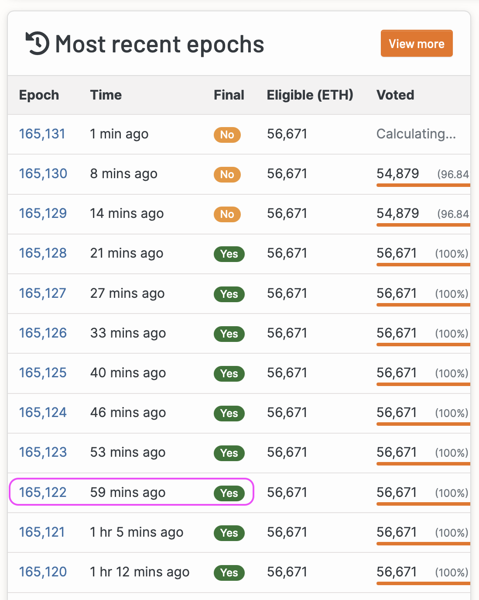
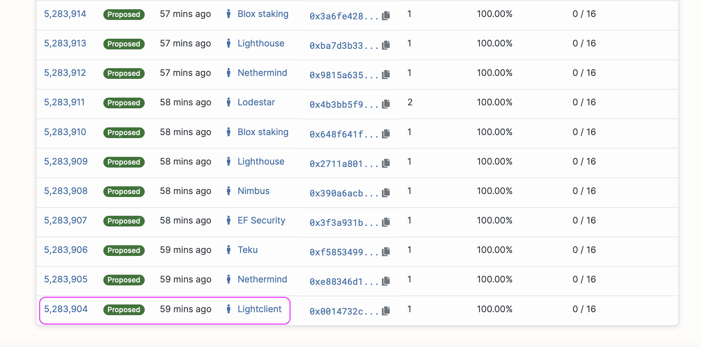

`blsync` is a beacon chain light client. Integrated within Gzond, blsync eliminates the necessity of running a separate [consensus client](/docs/getting-started/consensus-clients), making it ideal for use-cases that do not require full validation capabilities. It comes with very low resource requirements and can sync the beacon chain within seconds. `blsync` can be run in two modes: integrated or standalone. In standalone mode it is possible to use it for driving other execution clients.

:::note
Important: blsync is not suitable for running a validator. It is also not recommended for nodes handling any amount of money or used in production settings due to its lower security guarantees compared to running a full consensus client.
:::

## Usage

### Integrated mode

To run blsync as part of Gzond, you need to specify a public HTTP endpoint and a checkpoint:

- **Choose an Endpoint**: Select a reliable and available endpoint from the [Light Sync Endpoints](https://s1na.github.io/light-sync-endpoints/) list. These nodes are community-maintained.

- **Specify the Checkpoint**: Obtain a weak subjectivity checkpoint from a trusted node operator. The checkpoint should be less than 2 weeks old.

#### Checkpoint

A checkpoint is the block root of the first proposed slot of a finalized beacon epoch. In this guide we use [beaconcha.in](https://sepolia.beaconcha.in) to find a checkpoint:

- Visit sepolia.beaconcha.in.
- Navigate to the latest finalized epoch that is ideally 1 hour old.

- Open the epoch details and find the first proposed slot at the end of the page.

- Copy the block root field.


#### Example

The following command can be used to start Gzond with blsync on the Sepolia network. Note that the checkpoint root will be outdated two weeks after the writing of this page and a recent one will have to be picked according to the guide above:

```terminal
./build/bin/gzond --sepolia --beacon.api https://sepolia.lightclient.xyz --beacon.checkpoint 0x0014732c89a02315d2ada0ed2f63b32ecb8d08751c01bea39011b31ad9ecee36
```

### Running `blsync` as a Standalone Tool

As mentioned before, `blsync` can be run in standalone mode. This will be similar to running a consensus client with low resource requirements and faster sync times. In most cases Gzond users can use the integrated mode for convenience. The standalone mode can be used e.g. to drive an execution client other than Gzond.

#### Installing

Depending on your [installation method](/docs/getting-started/installing-gzond) either you have access to the `blsync` binary or you will have to build it from source by:

```terminal
go build ./cmd/blsync
```

#### Running

Blsync takes the same flags as above to configure the HTTP endpoint as well as checkpoint. It additionally needs flags to connect to the execution client. Specifically `--blsync.engine.api` to configure the Engine API url and `--blsync.jwtsecret` for the JWT authentication token.

Again to sync the Sepolia network in this mode, first run Gzond:

```terminal
./build/bin/gzond --sepolia --datadir light-sepolia-dir
```

The logs will indicate the Engine API path which is by default `http://localhost:8551` and the path to the JWT secret created which is in this instance `./light-sepolia-dir/gzond/jwtsecret`. Now blsync can be run:

```terminal
./blsync --sepolia --beacon.api https://sepolia.lightclient.xyz --beacon.checkpoint 0x0014732c89a02315d2ada0ed2f63b32ecb8d08751c01bea39011b31ad9ecee36 --blsync.engine.api http://localhost:8551 --blsync.jwtsecret light-sepolia-dir/gzond/jwtsecret

INFO [06-23|15:06:33.388] Loaded JWT secret file                   path=light-sepolia-dir/gzond/jwtsecret crc32=0x5a92678
INFO [06-23|15:06:34.130] Successful NewPayload                    number=6,169,314 hash=d4204e..772e65 status=SYNCING
INFO [06-23|15:06:34.130] Successful ForkchoiceUpdated             head=d4204e..772e65 status=SYNCING
```
