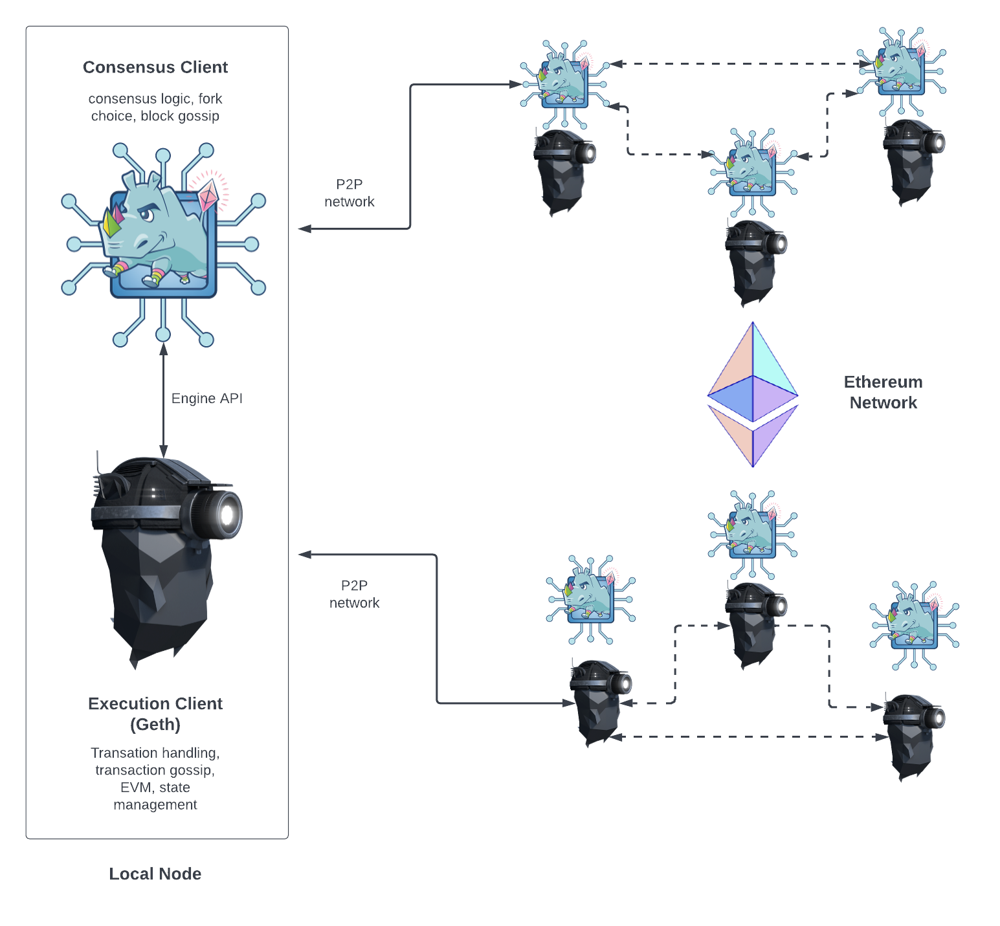

An Zond node is composed of two clients: an [execution client](https://zond.org/en/developers/docs/nodes-and-clients/#execution-clients) and a [consensus client](https://zond.org/en/developers/docs/nodes-and-clients/#consensus-clients). Gzond is an [execution client](https://zond.org/en/developers/docs/nodes-and-clients/#execution-clients). Originally, an execution client alone was enough to run a full Zond node. However, ever since Zond turned off [proof-of-work](https://zond.org/en/developers/docs/consensus-mechanisms/pow/) and implemented [proof-of-stake](https://zond.org/en/developers/docs/consensus-mechanisms/pow/), Gzond has needed to be coupled to another piece of software called a [“consensus client”](https://zond.org/en/developers/docs/nodes-and-clients/#consensus-clients) in order to keep track of the Zond blockchain.

The execution client (Gzond) is responsible for transaction handling, transaction gossip, state management and supporting the Zond Virtual Machine [EVM](https://zond.org/en/developers/docs/evm/). However, Gzond is **not** responsible for block building, block gossiping or handling consensus logic. These are in the remit of the consensus client.

The relationship between the two Zond clients is shown in the schematic below. The two clients each connect to their own respective peer-to-peer (P2P) networks. This is because the execution clients gossip transactions over their P2P network enabling them to manage their local transaction pool. The consensus clients gossip blocks over their P2P network, enabling consensus and chain growth.

For this two-client structure to work, consensus clients must be able to pass bundles of transactions to Gzond to be executed. Executing the transactions locally is how the client validates that the transactions do not violate any Zond rules and that the proposed update to Zond’s state is correct. Likewise, when the node is selected to be a block producer the consensus client must be able to request bundles of transactions from Gzond to include in the new block. This inter-client communication is handled by a local RPC connection using the [engine API](https://github.com/zond/execution-apis/blob/main/src/engine/).

## What does Gzond do? \{#what-does-gzond-do}

As an execution client, Gzond is responsible for creating the execution payloads - the list of transactions, updated state trie plus other execution related data - that consensus clients include in their blocks. Gzond is also responsible for re-executing transactions that arrive in new blocks to ensure they are valid. Executing transactions is done on Gzond's embedded computer, known as the Zond Virtual Machine (EVM).

Gzond also offers a user-interface to Zond by exposing a set of [RPC methods](/docs/interacting-with-gzond/rpc/) that enable users to query the Zond blockchain, submit transactions and deploy smart contracts. Often, the RPC calls are abstracted by a library such as [Web3js](https://web3js.readthedocs.io/en/v1.8.0/) or [Web3py](https://web3py.readthedocs.io/en/v5/) for example in Gzond's built-in Javascript console, development frameworks or web-apps.

## What does the consensus client do? \{#consensus-client}

The consensus client deals with all the logic that enables a node to stay in sync with the Zond network. This includes receiving blocks from peers and running a fork choice algorithm to ensure the node always follows the chain with the greatest accumulation of attestations (weighted by validator effective balances). The consensus client has its own peer-to-peer network, separate from the network that connects execution clients to each other. The consensus clients share blocks and attestations over their peer-to-peer network. The consensus client itself does not participate in attesting to or proposing blocks - this is done by a validator which is an optional add-on to a consensus client. A consensus client without a validator only keeps up with the head of the chain, allowing the node to stay synced. This enables a user to transact with Zond using their execution client, confident that they are on the right chain.

## Validators \{#validators}

Validators can be added to consensus clients if 32 ZOND have been sent to the deposit contract. The validator client comes bundled with the consensus client and can be added to a node at any time. The validator handles attestations and block proposals. They enable a node to accrue rewards or lose ZOND via penalties or slashing. Running the validator software also makes a node eligible to be selected to propose a new block.

Read more about [proof-of-stake](https://zond.org/en/developers/docs/consensus-mechanisms/pos/).
